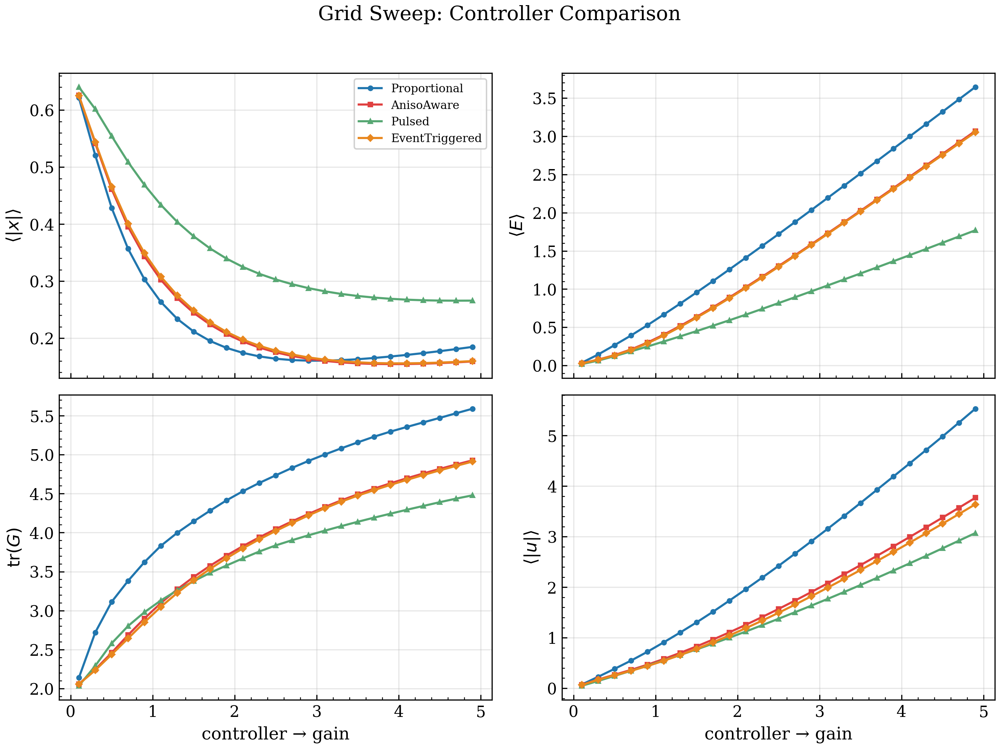
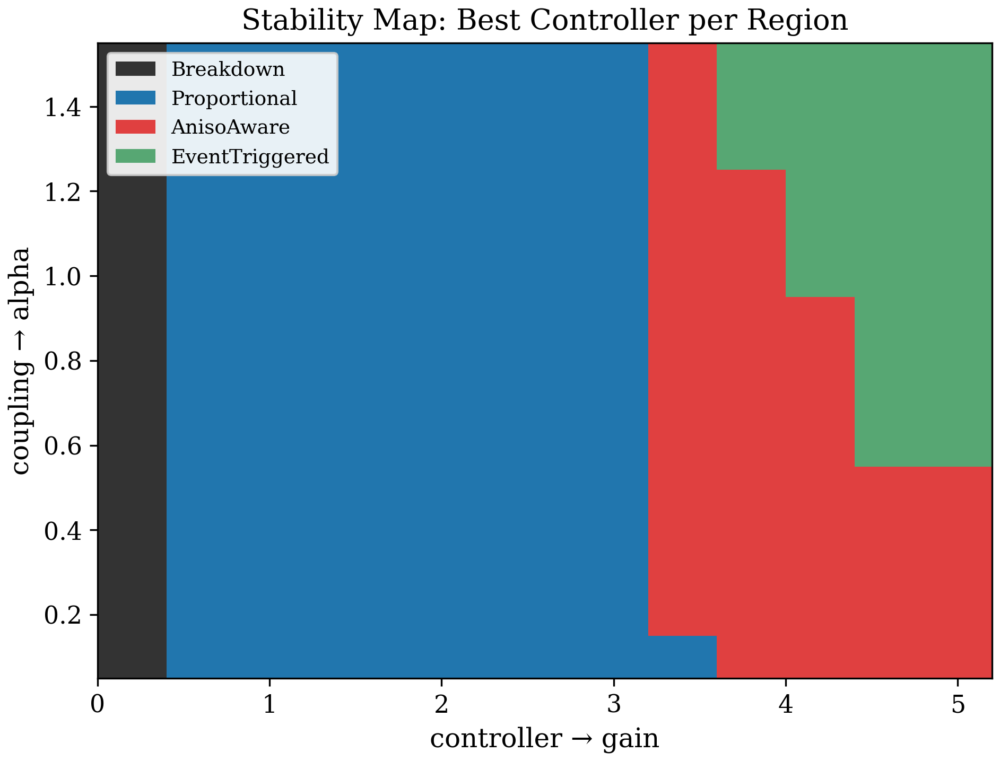

# Anisotropy-Aware Control in Self-Organizing Media

Real-time simulation and analysis of structure-aware control strategies
in spatially extended systems with tensor-valued connectivity.



## What is this?

A 2D grid of dynamical systems coupled through a **connectivity tensor G**.
Control effort heats the medium; heat flows anisotropically through G⁻¹;
excessive heating destroys connectivity, making further control ineffective.

The central question: **can a controller that reads the structure of the
medium outperform a blind one?**

Short answer: **yes** — by directing effort along the "healthy" eigenvectors
of G, the anisotropy-aware controller achieves better tracking with less
energy, and avoids the overheating trap that limits proportional control.



## Key results

- **Proportional control has an optimum beyond which it gets worse.**
  At high gain it overheats the medium, degrading connectivity faster
  than it can stabilize the state.

- **Structure-aware (AnisoAware) control is both more precise and more
  efficient.** It reads G's eigenstructure and pushes harder where
  connectivity is intact.

- **Event-triggered + anisotropy-aware** combines minimal intervention
  (activates only when instability is detected) with directional
  awareness — lowest energy cost at near-optimal precision.

- **Phase diagram (gain × coupling)** reveals a stability window:
  a narrow region where control forms structure without destroying it.

## Architecture

```
include/aniso/
  types.hpp          — Vec<Dim>, Mat<Dim>, TensorField<Dim> (Eigen)
  controller.hpp     — Proportional, AnisoAware, Pulsed, EventTriggered
  coupling.hpp       — Rank1 / Isotropic state-to-tensor coupling
  feedback.hpp       — Traceless / Full tensor feedback into state
  grid.hpp           — 2D GridEngine: state x, energy E, tensor G dynamics
  grid_benchmark.hpp — Parallel sweep infrastructure (std::async)
  config.hpp         — YAML parsing → engine construction

src/
  main.cpp           — CLI: run, bench, sweep, grid_sweep, grid_sweep2d
  gui_main.cpp       — Real-time GUI (Dear ImGui + ImPlot + GLFW)

configs/
  grid_demo.yaml     — Interactive demo configuration
  grid_sweep.yaml    — 1D sweep (gain)
  grid_sweep2d.yaml  — 2D phase diagram (gain × alpha)

scripts/
  plot_sweep.py      — Publication figures from 1D sweep CSV
  plot_phase.py      — Phase diagram heatmaps from 2D sweep CSV
```

## Build

Requirements: C++20 compiler (MSVC 2022 / GCC 12+ / Clang 15+), CMake 3.20+.
Dependencies (fetched automatically): Eigen 3.4, yaml-cpp, GLFW, Dear ImGui, ImPlot.

```bash
cmake -B build -DCMAKE_BUILD_TYPE=Release
cmake --build build --config Release
```

## Run

**Interactive GUI:**
```bash
./build/aniso_gui --config configs/grid_demo.yaml
```

**1D parameter sweep (parallel):**
```bash
./build/aniso grid_sweep configs/grid_sweep.yaml
python scripts/plot_sweep.py grid_sweep.csv figures/
```

**2D phase diagram (parallel):**
```bash
./build/aniso grid_sweep2d configs/grid_sweep2d.yaml
python scripts/plot_phase.py grid_sweep2d.csv figures/
```

## Physics model

Each grid cell (i, j) has state **x**, energy **E**, and connectivity tensor **G**:

1. **Controller** computes u(x, G) — may be structure-aware
2. **Energy injection**: E += f(|u|) · dt  (control = heating)
3. **Energy diffusion** through G⁻¹: anisotropic, blocked by barriers
4. **Energy dissipation**: E -= γ · E · dt
5. **G relaxation** toward identity with τ_eff = τ₀(1 + κ · aniso²)
6. **Stochastic noise** scaled by √E — thermal fluctuations

The connectivity tensor G simultaneously defines spatial structure
and mediates transport, creating a natural feedback loop between
control effort and medium integrity.

## Controllers

| Controller | Strategy | Key property |
|---|---|---|
| Proportional | u = −K·x | Baseline; overheats at high gain |
| AnisoAware | u = −K(G)·x, K weighted by G eigenvectors | Pushes along healthy axes |
| Pulsed | Proportional with duty cycle | Allows cooling between pulses |
| EventTriggered | AnisoAware, activates on threat detection | Minimal energy, smart direction |

## About

This repository explores dynamic systems where control effort
interacts with system structure and degradation.

If you work on simulation, system dynamics or control
and encounter difficult or unexpected behaviour in models,
feel free to reach out.

**Konstantin Budrin** — [LinkedIn](https://www.linkedin.com/in/konstantin-b-658845156/) · [kbudrin@gmail.com](mailto:kbudrin@gmail.com)

## License

MIT
