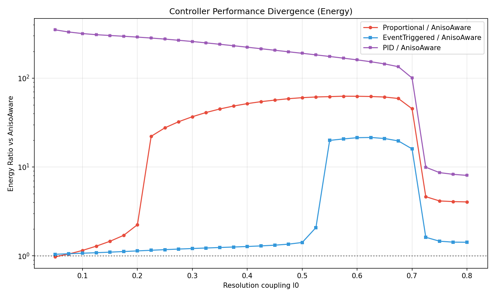
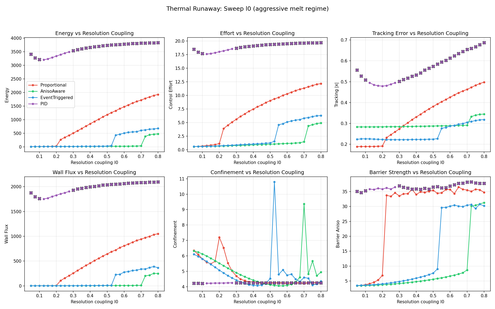

# Anisotropy-Aware Control in Self-Organizing Media

Simulation and analysis of structure-aware control strategies
in spatially extended systems with tensor-valued connectivity.



## What is this?

A 2D grid of dynamical systems coupled through a **connectivity tensor G**.
Control effort heats the medium; heat flows anisotropically through G⁻¹;
excessive heating destroys connectivity, making further control ineffective.

The central question: **what happens when actuation degrades observability?**

In classical control, sensing quality is assumed to be independent of actuation.
This model explores the consequences when that assumption breaks down:
control effort deforms the medium, the medium determines what can be observed,
and the controller must work with progressively degraded information.

## Key results

- **Resolution-aware control outperforms classical controllers by orders of magnitude**
  in degradation-coupled regimes. At strong coupling, AnisoAware maintains
  energy ~20 while Proportional diverges to ~1200 and PID to ~3700.

- **PID is structurally incompatible with degradation-coupled systems.**
  The integral term accumulates error caused by medium degradation,
  driving waste heat that further destroys observability — a positive
  feedback loop that leads to catastrophic breakdown.

- **Pulsed heating changes the controllability landscape.**
  Heating in bursts instead of continuously creates recovery windows
  where the medium regains structure and observability improves.
  This shifts the stability boundary, making previously uncontrollable
  regimes accessible.

- **Phase transitions between stable and runaway attractors** are sharp
  and controller-dependent. The critical resolution coupling l₀ where
  the system transitions from cold (stable) to hot (runaway) differs
  by 3–4x between Proportional and AnisoAware.



## Controllers

| Controller | Strategy | Behavior in degradation regime |
|---|---|---|
| Proportional | u = −K·x | Overheats; finds bad but bounded hot attractor |
| PID | u = −Kp·x − Ki·∫x − Kd·dx/dt | Integral term feeds degradation loop; catastrophic |
| AnisoAware | K weighted by G eigenvectors and Fisher information | Directs effort along well-observed axes; stable deepest |
| EventTriggered | AnisoAware, activates on threat detection | Minimal energy with directional awareness |

## Heater strategies

| Heater | Strategy |
|---|---|
| Constant | Continuous power injection |
| Pulsed | Periodic on/off with configurable duty cycle |
| EventDriven | Activates on local barrier health |
| GlobalEvent | Activates on global barrier anisotropy |
| AdaptivePulsed | Adjusts duty cycle based on barrier health |

## Architecture

```
include/aniso/
  types.hpp          — Vec<Dim>, Mat<Dim>, TensorField<Dim> (Eigen)
  controller.hpp     — Proportional, PID, AnisoAware, Pulsed, EventTriggered
  resolution.hpp     — Resolution scale L(G) = l₀ · G^(α/2)
  observer.hpp       — Resolution-limited observer with Fisher information
  coupling.hpp       — Rank1 / Isotropic state-to-tensor coupling
  feedback.hpp       — Traceless / Full tensor feedback into state
  g_response.hpp     — G dynamics: relax_aniso, relax_energy, melt, landau_energy
  heater.hpp         — Constant, Pulsed, EventDriven, GlobalEvent, AdaptivePulsed
  grid.hpp           — 2D GridEngine: full tensor Laplacian, wall absorption
  grid_benchmark.hpp — Parallel 1D/2D sweep infrastructure (std::async)
  config.hpp         — YAML parsing → engine construction

src/
  main.cpp           — CLI: run, bench, sweep, grid_sweep, grid_sweep2d
  gui_main.cpp       — Real-time GUI (Dear ImGui + ImPlot + GLFW)

configs/
  grid_demo.yaml              — Interactive demo
  overnight_thermal_runaway.yaml   — 1D sweep: resolution coupling l₀
  overnight_disruption_map.yaml    — 2D sweep: heater power × cooling rate
  overnight_pulsed_critical.yaml   — 2D sweep: heater power × duty cycle
  overnight_landau.yaml            — 1D sweep: Landau phase transition
  overnight_adaptive_critical.yaml — 2D sweep: adaptive heater power × l₀

scripts/
  plot_overnight.py  — Publication figures from overnight sweep CSVs
  plot_heater_all.py — Heater strategy comparison plots
  plot_atlas.py      — Parameter atlas generation
```

## Build

Requirements: C++20 compiler (MSVC 2022 / GCC 12+ / Clang 15+), CMake 3.20+.
Dependencies (fetched automatically): Eigen 3.4, yaml-cpp, GLFW, Dear ImGui, ImPlot.

```bash
cmake -B build -DCMAKE_BUILD_TYPE=Release
cmake --build build --config Release
```

## Run

**Interactive GUI:**
```bash
./build/aniso_gui configs/grid_demo.yaml
```

**1D parameter sweep (parallel, multi-controller):**
```bash
./build/aniso grid_sweep configs/overnight_thermal_runaway.yaml
python scripts/plot_overnight.py
```

**2D phase diagram (parallel, multi-controller):**
```bash
./build/aniso grid_sweep2d configs/overnight_disruption_map.yaml
python scripts/plot_overnight.py
```

## Physics model

Each grid cell (i, j) has state **x**, energy **E**, and connectivity tensor **G**:

1. **Controller** computes u(x, G, F) — may use Fisher information
2. **Energy injection**: E += η|u|² · dt  (control effort → waste heat)
3. **Energy diffusion** via full tensor Laplacian ∇·(G⁻¹·∇E)
4. **Energy dissipation**: E -= γ · E · dt
5. **G response** to energy: melt, Landau transition, or relaxation
6. **Resolution coupling**: observation noise scales as L(G) = l₀ · G^(α/2)
7. **Heater**: external energy source (constant, pulsed, or adaptive)

The connectivity tensor G simultaneously defines spatial structure
and mediates transport. When control effort heats the medium, G degrades,
observation quality drops, and the controller must compensate — creating
a feedback loop between actuation and observability.

## About

This project explores a class of systems where control effort
interacts with system structure: actuation degrades the medium,
the medium determines what can be observed, and classical control
assumptions about fixed observability break down.

The model is not specific to any single application.
The structural mechanism — control-induced degradation of observability —
may appear in thermal systems, stressed materials, reactive processes,
and other domains where the actuator changes the medium itself.

**Konstantin Budrin** — [LinkedIn](https://www.linkedin.com/in/konstantin-b-658845156/) · [kbudrin@gmail.com](mailto:kbudrin@gmail.com)

## License

MIT
