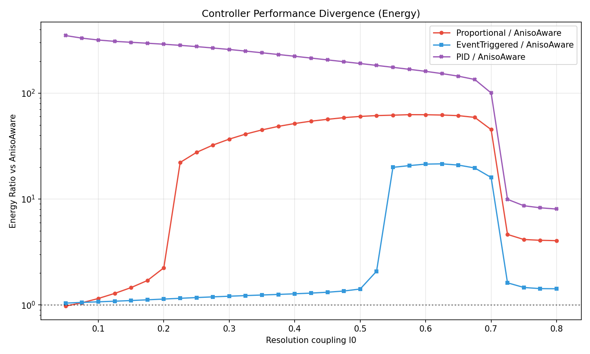
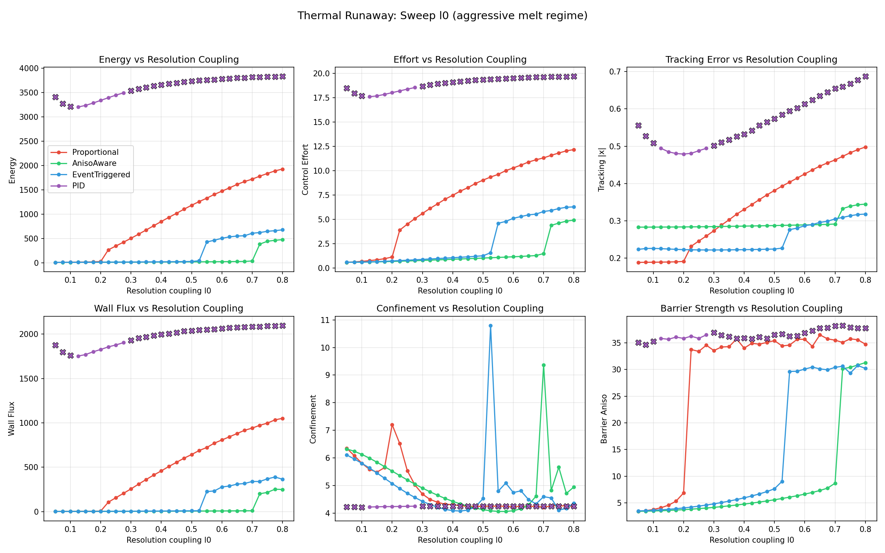
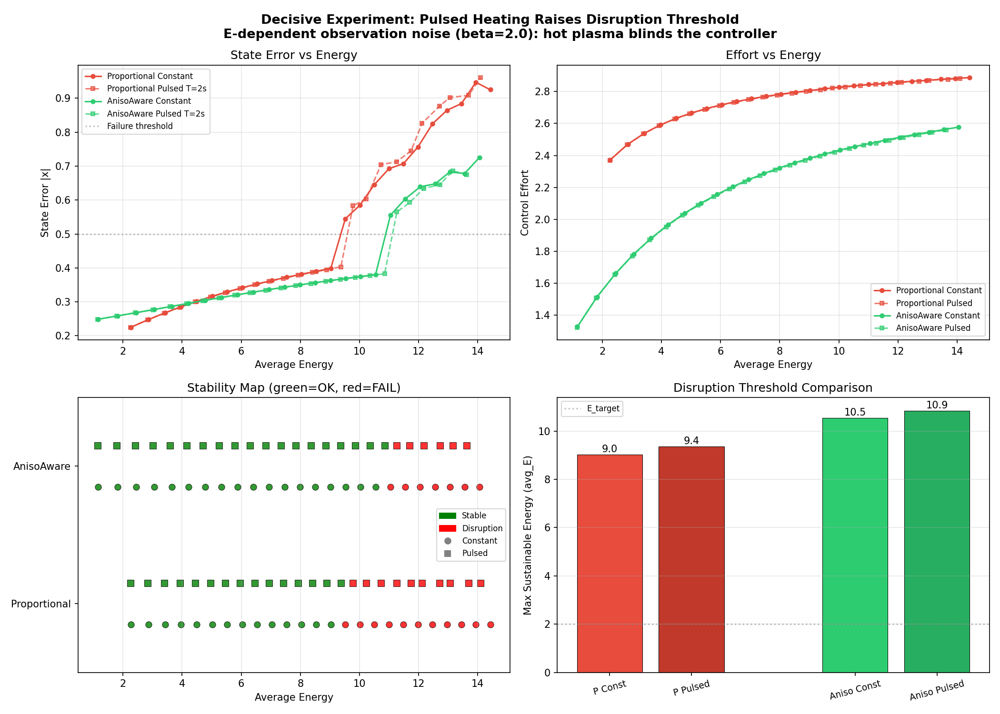
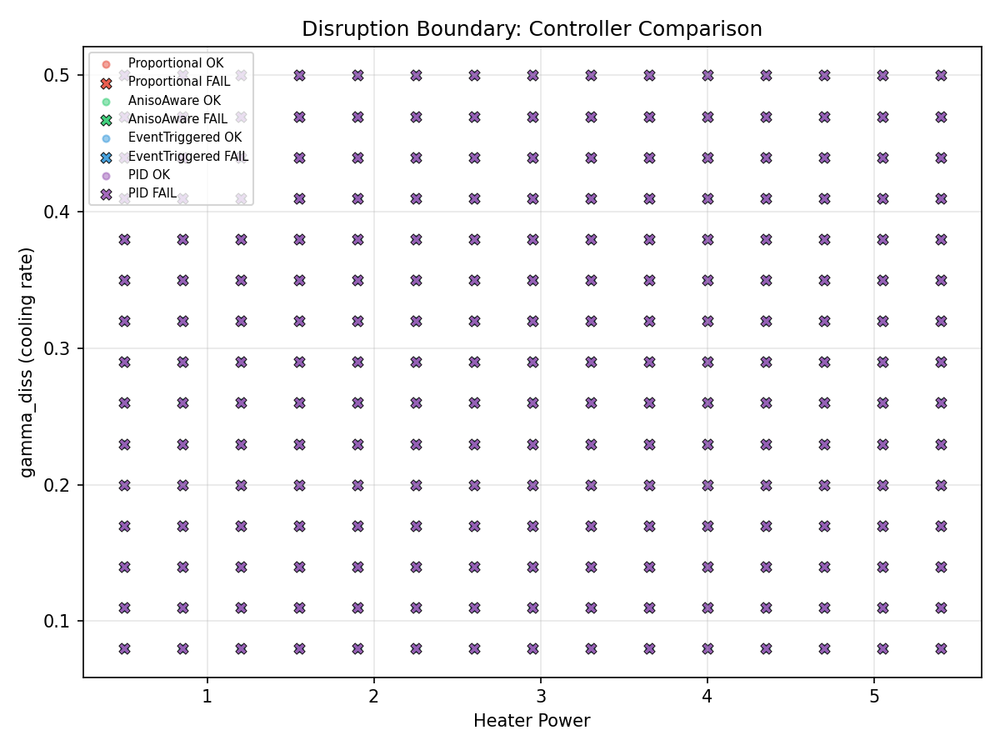
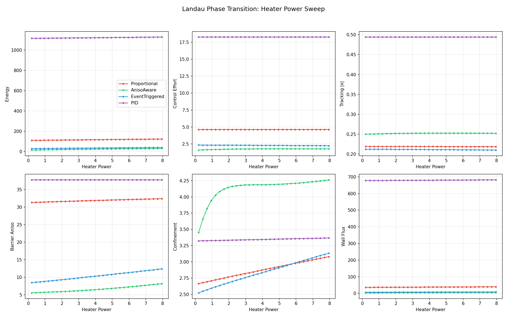
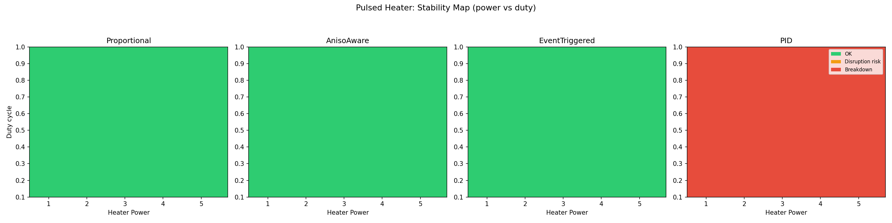
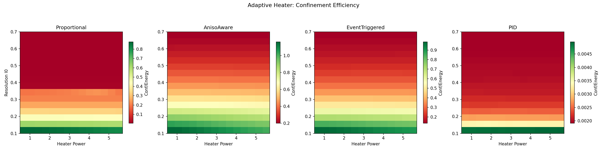
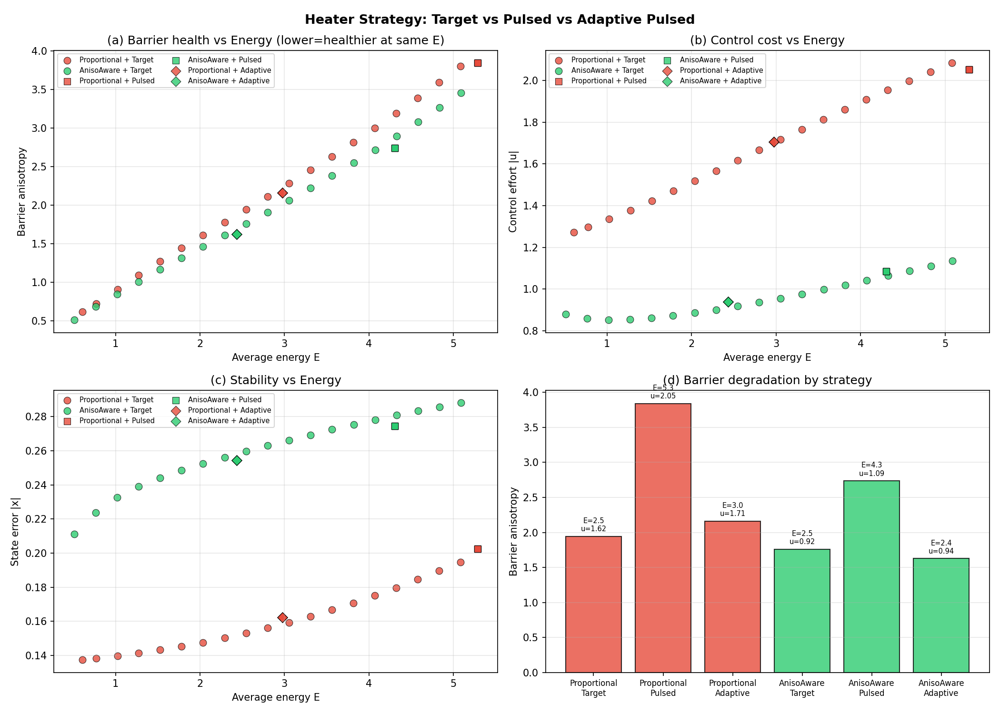

# Anisotropy-Aware Control in Self-Organizing Media

Simulation and analysis of structure-aware control strategies
in spatially extended systems with tensor-valued connectivity.



## What is this?

A 2D grid of dynamical systems coupled through a **connectivity tensor G**.
Control effort heats the medium; heat flows anisotropically through G⁻¹;
excessive heating destroys connectivity, making further control ineffective.

The central question: **what happens when actuation degrades observability?**

In classical control, sensing quality is assumed to be independent of actuation.
This model explores the consequences when that assumption breaks down:
control effort deforms the medium, the medium determines what can be observed,
and the controller must work with progressively degraded information.

## Key results

- **Resolution-aware control outperforms classical controllers by orders of magnitude**
  in degradation-coupled regimes. At strong coupling, AnisoAware maintains
  energy ~20 while Proportional diverges to ~1200 and PID to ~3700.

- **PID is structurally incompatible with degradation-coupled systems.**
  The integral term accumulates error caused by medium degradation,
  driving waste heat that further destroys observability — a positive
  feedback loop that leads to catastrophic breakdown.

- **Pulsed heating creates observation windows that restore controllability.**
  Heating in bursts instead of continuously lets the medium recover
  structure and observability between pulses.
  This shifts the stability boundary, making previously uncontrollable
  regimes accessible.

- **Phase transitions between stable and runaway attractors** are sharp
  and controller-dependent. The critical resolution coupling l₀ where
  the system transitions from cold (stable) to hot (runaway) differs
  by 3–4x between Proportional and AnisoAware.

- **Energy-dependent observation noise** (`E_noise_beta`) models the
  physical effect where hot media emit more radiation background,
  degrading diagnostics. This closes the loop: actuation → heating →
  noise → worse control → more actuation.

- **Landau-type phase transitions** in the G tensor produce sharp
  barrier formation/collapse events that depend on local energy,
  reproducing disruption-like phenomenology.



## Physics model

Each grid cell (i, j) has state **x** ∈ ℝ², energy **E** ∈ ℝ, and connectivity tensor **G** ∈ Sym⁺(2):

1. **Observation**: y = x + L(G) · ξ · √(1 + β·E), where L(G) = l₀ · G^(α/2) is the resolution tensor and β = `E_noise_beta` couples energy to observation noise
2. **Control**: u = f(y, Ĝ, F) — controller acts on noisy observation; may use Fisher information F = L⁻²
3. **Energy injection**: E += η|u|² · dt (control effort → waste heat)
4. **External heating**: E += Q(t, x, E, G) · dt (heater strategy)
5. **Energy diffusion**: full tensor Laplacian ∇·(G⁻¹·∇E)
6. **Energy dissipation**: E −= γ · E · dt
7. **G response**: dG/dt = drive(u) + relax(G) + interaction(G) + noise(E) — multiple models below
8. **State diffusion**: ∇·(G⁻¹·∇x) couples neighboring cells
9. **Wall absorption**: cells outside radius r_wall have E = 0, x = 0 (cylindrical boundary)

The connectivity tensor G simultaneously defines spatial structure
and mediates transport. When control effort heats the medium, G degrades,
observation quality drops, and the controller must compensate — creating
a feedback loop between actuation and observability.

### Resolution and Fisher information

The **resolution tensor** L(G) = l₀ · G^(α/2) sets the observation noise scale along each direction.
`l₀` controls the base coupling strength between medium geometry and observation quality.
`α` controls how steeply resolution degrades with anisotropy:

| α   | Regime |
|-----|--------|
| 0   | No coupling — observation quality independent of G (classical limit) |
| 1   | Standard metric geometry: observation noise scales as √G |
| > 1 | Supercritical — resolution degrades faster than the metric stretches |

**Fisher information** F = L⁻² = (1/l₀²) · G^(−α) quantifies observation quality per direction.
The AnisoAware controller projects its gain onto G eigenvectors weighted by F,
directing effort along well-observed axes and avoiding waste on poorly resolved directions.

### G-response models

The connectivity tensor evolves according to one of four models:

| Model | Equation | Physics |
|-------|----------|---------|
| `relax_aniso` | τ_eff = τ₀(1 + κ·aniso²) | Anisotropy slows its own relaxation → self-sustaining barriers |
| `relax_energy` | τ_eff = τ₀(1 + κ·E) | Hot zones relax slower — energy "freezes" deformed G |
| `melt` | dG += κ·E·(I − G) | Energy directly pushes G toward isotropy, erasing structure |
| `landau_energy` | dG += κ(E − E_c)·Q − ν|Q|²·Q | Phase transition: below E_c anisotropy is suppressed, above E_c it grows until saturated by cubic nonlinearity |

All models include stochastic forcing: dG += σ·√E · dW (noise amplitude scales with energy).

### Disruption criteria

The sweep infrastructure tracks multiple disruption indicators:

| Criterion | Condition |
|-----------|-----------|
| `breakdown` | Tracking error diverges (|x| exceeds threshold in tail period) |
| `disruption` | Barrier collapses AND energy reaches the wall |
| `underheat` | Core energy falls below E_target (fusion margin < 1) |

## Controllers

| Controller | Strategy | Behavior in degradation regime |
|---|---|---|
| `proportional` | u = −K·y | Overheats; finds bad but bounded hot attractor |
| `pid` | u = −Kp·y − Ki·∫y − Kd·dy/dt | Integral term feeds degradation loop; catastrophic. Anti-windup clamp included but structurally insufficient |
| `aniso_aware` | K weighted by G eigenvectors and Fisher F | Directs effort along well-observed axes; stable deepest into the degradation regime |
| `pulsed` | Proportional with periodic on/off | Reduces time-averaged heat input; allows partial medium recovery |
| `event_triggered` | AnisoAware, activates on threat detection | Minimal energy with directional awareness; sleeps when system is stable, wakes with anticipation on deviation growth |

## Heater strategies

| Heater | Strategy | Key parameters |
|---|---|---|
| `constant` | Continuous power injection | `power` |
| `pulsed` | Periodic on/off | `power`, `period`, `duty` |
| `event_driven` | Activates on local G anisotropy health | `power`, `trigger`, `hysteresis` |
| `aniso_aware` | More power where G is isotropic (barrier weak) | `power` |
| `global_event` | On/off based on grid-wide barrier health | `power`, `trigger`, `hysteresis` |
| `adaptive_pulsed` | Duty cycle adapts to barrier health | `power`, `period`, `duty_min`, `barrier_target` |
| `target` | P-regulator on local energy toward E_target | `power`, `E_target`, `k_heat` |

## Architecture

```
include/aniso/
  types.hpp           — Vec<Dim>, Mat<Dim>, TensorField<Dim>, Observation (Eigen-based)
                        Fast analytical 2×2 eigendecomposition (fast2 namespace)
  resolution.hpp      — IResolution interface: IdentityResolution, MetricResolution
                        L(G) = l₀·G^(α/2), Fisher F = L⁻²
  observer.hpp        — ResolutionObserver: state + G observation with energy-dependent noise
  controller.hpp      — Proportional, AnisoAware, Pulsed, EventTriggered, PID
  coupling.hpp        — Control-to-tensor coupling: Rank1 (u⊗u) and Isotropic (|u|^γ·I)
  interaction.hpp     — Tensor self-interaction: NoInteraction, LandauInteraction (re-entrant)
  feedback.hpp        — Tensor-to-state feedback: NoFeedback, TracelessFeedback, FullFeedback
  g_response.hpp      — G dynamics: RelaxAniso, RelaxEnergy, Melt, LandauEnergy
  heater.hpp          — Constant, Pulsed, EventDriven, AnisoAware, GlobalEvent,
                        AdaptivePulsed, TargetHeater
  engine.hpp          — Single-cell Engine: one (x, G) pair, full time loop
  chain.hpp           — 1D ChainEngine: N coupled cells with diffusion and bistability
  grid.hpp            — 2D GridEngine: Nx×Ny cells, full tensor Laplacian, wall absorption,
                        disruption tracking (wall flux, confinement, barrier health)
  grid_benchmark.hpp  — Parallel sweep infrastructure (std::async): 1D and 2D parameter sweeps
                        with multi-controller comparison, CSV export, progress reporting
  recorder.hpp        — Time-series recording and metrics computation
  benchmark.hpp       — Single-cell controller benchmark
  config.hpp          — YAML → engine/grid construction (controllers, heaters, G-response, etc.)

src/
  main.cpp            — CLI: run, bench, sweep, grid_sweep, grid_sweep2d
  gui_main.cpp        — Real-time GUI (Dear ImGui + ImPlot + GLFW)
                        Live heatmaps (energy, anisotropy, wall flux), time-series plots,
                        parameter sliders, disruption indicators

scripts/
  plot_overnight.py   — Publication figures from overnight sweep CSVs
  plot_heater_all.py  — Heater strategy comparison plots
  plot_atlas.py       — 2D parameter atlas generation (stability, energy, effort, error)
  plot_sweep.py       — Generic 1D sweep visualization
  plot_critical.py    — Critical regime sweeps (stability boundaries)
  plot_fusion.py      — Fusion viability plots (margin, barrier, const vs pulsed)
  plot_heating.py     — Heating mode comparisons
  plot_heater.py      — Individual heater analysis
  plot_compare_heating.py — Side-by-side heater comparisons
  plot_duty_comparison.py — Duty cycle sweep analysis (Pareto, efficiency)
  plot_edge_comparison.py — Edge stability comparisons (const vs pulsed)
  plot_phase.py       — Phase transition diagrams
  plot_l0_sweep.py    — Resolution coupling parameter sweeps
  analyze_1d.py       — 1D chain analysis
  analyze_diff.py     — Differential analysis between sweep results
  check_cal.py        — Calibration checks

configs/
  grid_demo.yaml                   — Interactive GUI demo
  overnight_thermal_runaway.yaml   — 1D sweep: resolution coupling l₀
  overnight_disruption_map.yaml    — 2D sweep: heater power × cooling rate
  overnight_pulsed_critical.yaml   — 2D sweep: heater power × duty cycle
  overnight_landau.yaml            — 1D sweep: Landau phase transition
  overnight_adaptive_critical.yaml — 2D sweep: adaptive heater power × l₀
  sweep_fusion*.yaml               — Fusion viability parameter sweeps
  sweep_critical*.yaml             — Critical regime boundary searches
  sweep_power_*.yaml               — Power/dissipation/gain interaction sweeps
  sweep_heater_*.yaml              — Heater strategy comparison sweeps
  sweep_edge*.yaml                 — Edge stability (constant vs pulsed heating)
  sweep_*_diss*.yaml               — Dissipation parameter sweeps
  sweep_gain_*.yaml                — Gain/coupling interaction sweeps
  sweep_tau*.yaml                  — Relaxation time sweeps
  + ~70 more configurations for targeted parameter explorations

tests/
  test_scalar_limit.cpp — Verifies 2D engine reduces to scalar model when G → I
```

## Build

Requirements: C++20 compiler (MSVC 2022 / GCC 12+ / Clang 15+), CMake 3.20+.

Dependencies (fetched automatically via CMake FetchContent):
- [Eigen 3.4](https://eigen.tuxfamily.org/) — linear algebra
- [yaml-cpp 0.8](https://github.com/jbeder/yaml-cpp) — configuration parsing
- [GLFW 3.4](https://www.glfw.org/) — window/input for GUI
- [Dear ImGui 1.91](https://github.com/ocornut/imgui) — immediate mode GUI
- [ImPlot 0.16](https://github.com/epezent/implot) — real-time plots

```bash
cmake -B build -DCMAKE_BUILD_TYPE=Release
cmake --build build --config Release
```

## Run

### Interactive GUI

```bash
./build/aniso_gui configs/grid_demo.yaml
```

Live visualization of the 2D grid with parameter sliders,
energy/anisotropy heatmaps, time-series plots, and disruption indicators.

### Single simulation

```bash
./build/aniso run configs/grid_demo.yaml
```

### Controller benchmark (single-cell)

```bash
./build/aniso bench configs/benchmark_2d.yaml
```

### 1D parameter sweep (parallel, multi-controller)

```bash
./build/aniso grid_sweep configs/overnight_thermal_runaway.yaml
python scripts/plot_overnight.py
```

### 2D phase diagram (parallel, multi-controller)

```bash
./build/aniso grid_sweep2d configs/overnight_disruption_map.yaml
python scripts/plot_overnight.py
```

### Analysis scripts

All plotting scripts read CSV files produced by sweeps and generate
publication-quality PNG figures in `figures/`.

```bash
python scripts/plot_fusion.py           # fusion viability analysis
python scripts/plot_heater_all.py       # heater strategy comparison
python scripts/plot_atlas.py            # 2D parameter atlas
python scripts/plot_critical.py         # critical regime boundaries
python scripts/plot_duty_comparison.py  # duty cycle Pareto analysis
```

## Configuration

Simulations are configured through YAML files. Key sections:

```yaml
grid:
  Nx: 48
  Ny: 48
  dt: 0.01
  D_E: 0.5            # energy diffusion coefficient
  gamma_diss: 1.0      # energy dissipation rate
  D_x: 0.1            # state diffusion through G⁻¹
  eta_ctrl: 0.3        # control effort → heat coupling
  wall_radius: 0.45    # cylindrical boundary radius
  E_target: 0.0        # minimum core energy (fusion constraint)

resolution:
  type: metric         # or "identity"
  l0: 0.5              # base resolution coupling
  alpha: 1.0           # resolution exponent

observer:
  sigma_G: 0.3         # G estimation noise scale
  E_noise_beta: 0.0    # energy-dependent noise amplification

g_response:
  type: relax_aniso    # relax_aniso | relax_energy | melt | landau_energy
  tau: 1.0
  kappa: 20.0
  noise: 0.5

heater:
  type: pulsed         # constant | pulsed | event_driven | ...
  power: 3.0
  period: 2.0
  duty: 0.6

controller:
  type: aniso_aware    # proportional | pid | aniso_aware | event_triggered | pulsed
  gain: 1.5
  u_max: 3.0

sweep:                 # for grid_sweep / grid_sweep2d modes
  param: resolution.l0
  min: 0.0
  max: 2.0
  steps: 40
  n_steps: 10000
  warmup: 2000
```

## Gallery

| | |
|---|---|
|  |  |
| Pulsed heating restores controllability in regimes where constant heating leads to disruption | 2D disruption map: heater power × cooling rate |
|  |  |
| Energy-driven Landau transition in G tensor | Pulsed heater power × duty cycle stability |
|  |  |
| Adaptive duty cycle tracks barrier health | Heater strategy comparison across regimes |

## About

This project explores a class of systems where control effort
interacts with system structure: actuation degrades the medium,
the medium determines what can be observed, and classical control
assumptions about fixed observability break down.

The key insight — treating observability degradation not as an engineering
nuisance but as a fundamental feedback channel — connects control theory
with information geometry. The resolution tensor L(G) plays the role of
a metric on observation space, and Fisher information F provides a natural
basis for directing control effort.

The model is not specific to any single application.
The structural mechanism — control-induced degradation of observability —
may appear in thermal systems (tokamak plasma confinement), stressed materials,
reactive processes, and other domains where the actuator changes the medium itself.

**Konstantin Budrin** — [GitHub](https://github.com/Budrink/aniso-control) · [LinkedIn](https://www.linkedin.com/in/konstantin-b-658845156/) · [kbudrin@gmail.com](mailto:kbudrin@gmail.com)

## License

MIT
